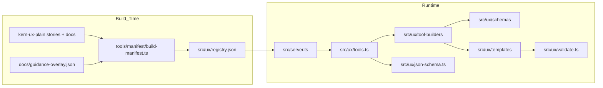

# Kern UX MCP Server

TypeScript MCP server that exposes Kern UX component tools (`get_*`), recursive composition rendering (`render_composition`), and strict accessibility validation (`validate_html`).

The repo has two main flows:

1. Build a static component registry from `kern-ux-plain` sources plus reviewed overlay guidance.
2. Use that registry to decide which MCP tools exist, then publish each tool's Zod input schema as JSON Schema for MCP clients.

## Prerequisites

- Node.js 24.16.0+

## How It Fits Together



At runtime the registry decides which tools and component metadata are exposed. The tool builders bind that metadata to Zod schemas from [src/ux/schemas](src/ux/schemas), and [src/ux/json-schema.ts](src/ux/json-schema.ts) converts those Zod schemas to JSON Schema for MCP tool discovery.

## Use In MCP Clients

The published package is a stdio MCP server. The default install path for end users is npmjs:

```json
{
  "mcpServers": {
    "kern-ux": {
      "command": "npx",
      "args": ["-y", "@leonio/kern-ux-mcp"]
    }
  }
}
```

If you prefer a global install, install the package once and reference the binary directly:

```bash
npm install -g @leonio/kern-ux-mcp
```

```json
{
  "mcpServers": {
    "kern-ux": {
      "command": "kern-ux-mcp"
    }
  }
}
```

GitHub Packages is also published, but it is not the zero-friction default because it requires GitHub Packages authentication and scope routing in `.npmrc`.

If you want to install from GitHub Packages instead of npmjs, add this to your user or project `.npmrc`:

```ini
@leonio:registry=https://npm.pkg.github.com
//npm.pkg.github.com/:_authToken=YOUR_GITHUB_PAT
```

Then the same MCP client config works:

```json
{
  "mcpServers": {
    "kern-ux": {
      "command": "npx",
      "args": ["-y", "@leonio/kern-ux-mcp"]
    }
  }
}
```

For GitHub Packages installs, your token needs package read access.

## Development Install

```bash
npm install
```

## Run From Source (stdio)

```bash
npm run dev
```

The server is runtime-decoupled from Kern UX source files and loads component metadata from the generated manifest:

- [src/ux/registry.json](src/ux/registry.json)

## Key Pieces

- [src/server.ts](src/server.ts): MCP transport, request handling, argument normalization, validation errors.
- [src/ux/tools.ts](src/ux/tools.ts): creates the tool registry, wires manifest metadata to tool builders, publishes JSON Schema.
- [src/ux/tool-builders](src/ux/tool-builders): strategy-specific tool construction.
- [src/ux/schemas](src/ux/schemas): Zod input schemas.
- [src/ux/templates](src/ux/templates): HTML builders.
- [src/ux/json-schema.ts](src/ux/json-schema.ts): Zod-to-JSON-Schema bridge used for MCP tool listing.
- [src/ux/validate.ts](src/ux/validate.ts): strict HTML validation rules.
- [tools/manifest](tools/manifest): registry generation and overlay validation.
- [docs](docs): checked-in contributor docs, manifest inputs, and workflow files.
- [docs/codebase-guide.md](docs/codebase-guide.md): detailed codebase map and change paths.

## Common Commands

Install dependencies:

```bash
npm install
```

Regenerate the registry after changing manifest inputs:

```bash
npm run generate-manifest
```

Run the server from source:

```bash
npm run dev
```

Build production output:

```bash
npm run build
```

Run tests, lint, and typecheck:

```bash
npm run test
npm run lint
npx tsc --noEmit
```

Generate a CycloneDX SBOM and run a local Grype scan:

```bash
npm run sbom:generate
npm run scan:vulns
```

Fail the local Grype scan on high-or-greater findings:

```bash
npm run scan:vulns:high
```

Build and inspect the package tarball with the generated SBOM included:

```bash
npm run pack:inspect
```

These commands expect local `syft` and `grype` binaries on `PATH`.

## Registry Build

Use the shipped [src/ux/registry.json](src/ux/registry.json) if you are only running or packaging the server. Regenerate it when you change any of the contributor-facing inputs:

- `kern-ux-plain` stories or markdown docs
- [docs/guidance-overlay.json](docs/guidance-overlay.json)
- [tools/manifest/build-manifest.ts](tools/manifest/build-manifest.ts)
- extraction or merge logic used by the manifest build

The build script already regenerates the manifest through `prebuild`, so `npm run build` is enough for a normal package build.

For release packaging, use `npm run pack:release` to build, generate `sbom.cyclonedx.json`, and create the npm tarball with the SBOM embedded.

Optional source override for generation:

- `KERN_UX_PLAIN_ROOT=/path/to/kern-ux-plain npm run generate-manifest`

## Dev Loop (Windows / PowerShell)

Use the loop scripts when you want a fast sample-app workflow with [samples/basic-layout](samples/basic-layout):

- `npm run loop:start`: sample app only
- `npm run loop:full`: sample app + test watch + TypeScript watch + open sample workspace
- `npm run loop:stop`: stop loop processes

The sample app itself can also be started directly:

```bash
npm run sample:dev
```

## More Docs

- [docs/codebase-guide.md](docs/codebase-guide.md): architecture, file map, and common change paths.
- [docs/contributor-guide.md](docs/contributor-guide.md): contributor architecture and manifest context.
- [docs/guidance-overlay-workflow.md](docs/guidance-overlay-workflow.md): reviewed guidance authoring workflow.
- [docs/air-gapped-guidance-plan.md](docs/air-gapped-guidance-plan.md): historical rationale.

## Contributor Workflow

- [docs/contributor-guide.md](docs/contributor-guide.md): human-facing contributor guide.
- [.github/instructions/guidance-overlay.instructions.md](.github/instructions/guidance-overlay.instructions.md): file-scoped rules for reviewed guidance and manifest work.
- [.github/instructions/component-change.instructions.md](.github/instructions/component-change.instructions.md): file-scoped rules for schema, template, and focused test changes.
- [.github/skills/component-update-workflow/SKILL.md](.github/skills/component-update-workflow/SKILL.md): self-contained workflow skill for routing component updates.
- [.github/prompts/draft-guidance-overlay-entry.prompt.md](.github/prompts/draft-guidance-overlay-entry.prompt.md): narrow prompt for drafting a single reviewed-guidance entry.

## Troubleshooting

- Registry missing at runtime: run `npm run generate-manifest` or `npm run build`.
- Manifest generation finds too few components: point `KERN_UX_PLAIN_ROOT` at the correct `kern-ux-plain` checkout.
- Overlay validation fails: fix [docs/guidance-overlay.json](docs/guidance-overlay.json), then rerun `npm run validate-guidance-overlay` and `npm run generate-manifest`.
- `syft` or `grype` not found locally: refresh your shell `PATH` after installation, then rerun `npm run sbom:generate` or `npm run scan:vulns`.

## Tools

- `get_<component>`: Returns canonical HTML (best-effort extracted from Storybook) plus validation results.
  - Params: `locale?: 'de'|'en'` (default `de`), `strict?: boolean`.
  - Experimental components include an HTML comment warning.
- `validate_html`: Strictly validates HTML against Kern UX A11Y contracts.
- `render_composition`: Renders recursive content blocks (Grid/Card/Section/Disclosure/Text/HTML/Button/Badge) as one composed layout.

## Composition Patterns

Use `render_composition` when you need nested structures in one call.

### Side-by-Side Cards

```json
{
  "locale": "de",
  "contentBlocks": [
    {
      "kind": "grid",
      "grid": {
        "columns": 2,
        "columnsContent": [
          [
            {
              "kind": "card",
              "card": {
                "header": { "title": "Linke Karte" },
                "contentBlocks": [{ "kind": "text", "text": "Inhalt links" }]
              }
            }
          ],
          [
            {
              "kind": "card",
              "card": {
                "header": { "title": "Rechte Karte" },
                "contentBlocks": [{ "kind": "text", "text": "Inhalt rechts" }]
              }
            }
          ]
        ]
      }
    }
  ]
}
```

### Deep Section Chain

```json
{
  "locale": "de",
  "contentBlocks": [
    {
      "kind": "section",
      "section": {
        "headingText": "Kompositionsbereich",
        "contentBlocks": [
          {
            "kind": "grid",
            "grid": {
              "columns": 1,
              "columnsContent": [
                [
                  {
                    "kind": "card",
                    "card": {
                      "header": { "title": "Karte mit Disclosure" },
                      "contentBlocks": [
                        {
                          "kind": "disclosure",
                          "disclosure": {
                            "triggerLabel": "Details anzeigen",
                            "open": true,
                            "contentBlocks": [
                              { "kind": "text", "text": "Tiefer Inhalt" }
                            ]
                          }
                        }
                      ]
                    }
                  }
                ]
              ]
            }
          }
        ]
      }
    }
  ]
}
```

## Notes / Known Repo Gaps

In this workspace snapshot, [kern-ux-plain](kern-ux-plain) references `scripts/` and `.storybook/` content that is not required by this MCP server workflow. Manifest generation and runtime behavior here do not rely on those missing parts.
