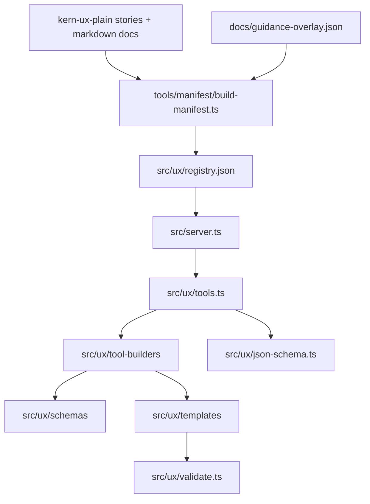

# Codebase Guide

This document is the short map for contributors who need to navigate the repo without reverse-engineering the whole runtime.

## Mental Model

The project has a build-time metadata pipeline and a runtime tool pipeline.



Important distinction:

- The registry decides what components and docs metadata exist at runtime.
- The Zod schemas live in code under [src/ux/schemas](../src/ux/schemas) and remain the source of truth for tool inputs.
- MCP clients see JSON Schema because [src/ux/json-schema.ts](../src/ux/json-schema.ts) converts those Zod schemas when tools are listed.

## Directory Map

- [src/server.ts](../src/server.ts): MCP server setup, request handling, argument normalization, error formatting.
- [src/ux/tools.ts](../src/ux/tools.ts): creates the tool registry, selects tool builders, lists tools for MCP.
- [src/ux/tool-builders](../src/ux/tool-builders): strategy-specific tool construction shared across many components.
- [src/ux/schemas](../src/ux/schemas): Zod schemas for tool inputs.
- [src/ux/templates](../src/ux/templates): HTML rendering for components and composition blocks.
- [src/ux/json-schema.ts](../src/ux/json-schema.ts): converts Zod input schemas to JSON Schema.
- [src/ux/registry.json](../src/ux/registry.json): generated runtime manifest artifact.
- [src/ux/registry.ts](../src/ux/registry.ts): loads the generated manifest.
- [src/ux/validate.ts](../src/ux/validate.ts): strict HTML validation rules used by tools.
- [tools/manifest](../tools/manifest): registry build and overlay validation scripts.
- [docs](../docs): contributor docs, manifest inputs, overlay schema, and historical notes.
- [.github/instructions](../.github/instructions): targeted file-scoped workflow rules.
- [.github/skills/component-update-workflow](../.github/skills/component-update-workflow): self-contained workflow skill with YAML references.
- [samples/basic-layout](../samples/basic-layout): sample app and MCP wiring for local development.

## Common Change Paths

### 1. Change component rendering

Typical path:

1. Update the component schema in [src/ux/schemas](../src/ux/schemas).
2. Update the matching renderer in [src/ux/templates](../src/ux/templates).
3. Update the nearest focused tests.

This is the normal path when you change HTML output, validation-friendly defaults, or input shape.

### 2. Change the manifest or packaged docs

Typical path:

1. Update the relevant `kern-ux-plain` source, or change [docs/guidance-overlay.json](guidance-overlay.json).
2. Run `npm run validate-guidance-overlay` if the overlay changed.
3. Run `npm run generate-manifest`.

This is the normal path when you change component metadata, canonical HTML extraction, or reviewed guidance.

### 3. Change the MCP surface

Typical path:

1. Update [src/ux/tools.ts](../src/ux/tools.ts) or a file in [src/ux/tool-builders](../src/ux/tool-builders).
2. If tool input listing changes, check [src/ux/json-schema.ts](../src/ux/json-schema.ts).
3. If request handling or validation messaging changes, check [src/server.ts](../src/server.ts).

This is the normal path when you add a tool, change how tools are listed, or adjust validation behavior at the MCP boundary.

## Build And Validation Commands

Install:

```bash
npm install
```

Regenerate the registry:

```bash
npm run generate-manifest
```

Build:

```bash
npm run build
```

Validate code:

```bash
npm run lint
npx tsc --noEmit
npm run test
```

Focused manifest workflow:

```bash
npm run validate-guidance-overlay
npm run generate-manifest
npm test -- src/ux/manifest-generator.test.ts src/ux/tools.test.ts
```

## Where To Start Reading

- Runtime behavior: start at [src/server.ts](../src/server.ts), then [src/ux/tools.ts](../src/ux/tools.ts).
- Tool input/output shape: start at [src/ux/schemas](../src/ux/schemas) and [src/ux/templates](../src/ux/templates).
- Manifest and docs packaging: start at [tools/manifest/build-manifest.ts](../tools/manifest/build-manifest.ts).
- Guidance authoring: start at [guidance-overlay-workflow.md](guidance-overlay-workflow.md), then load [../.github/skills/component-update-workflow/SKILL.md](../.github/skills/component-update-workflow/SKILL.md) for the self-contained workflow path.