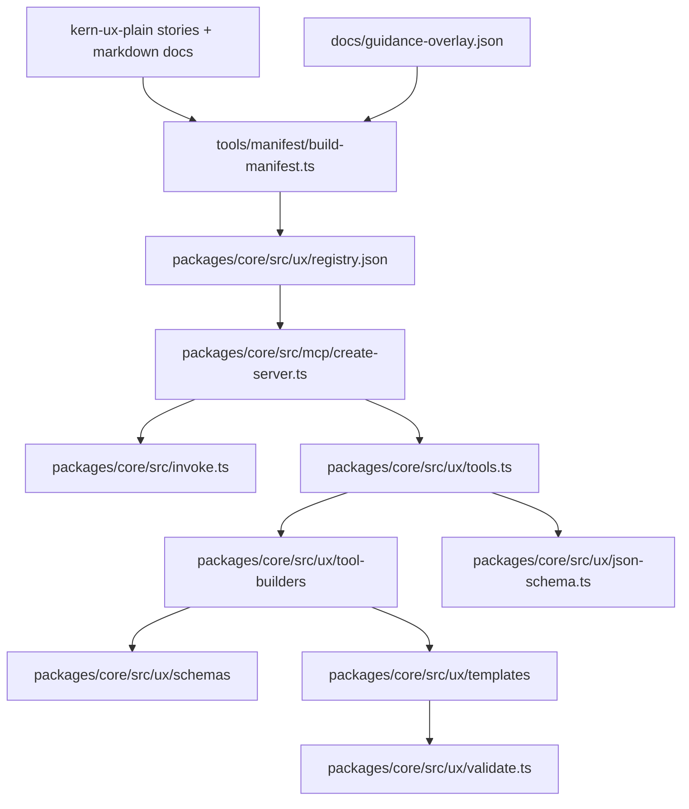

# Codebase Guide

This document is the short map for contributors who need to navigate the repo without reverse-engineering the whole runtime.

## Mental Model

The project has a build-time metadata pipeline and a runtime tool pipeline.


```mermaid
flowchart TD
  A[kern-ux-plain stories + markdown docs] --> B[tools/manifest/build-manifest.ts]
  C[docs/guidance-overlay.json] --> B
  B --> D[packages/core/src/ux/registry.json]
  D --> E[packages/core/src/mcp/create-server.ts]
  E --> P[packages/core/src/invoke.ts]
  E --> F[packages/core/src/ux/tools.ts]
  F --> G[packages/core/src/ux/tool-builders]
  G --> H[packages/core/src/ux/schemas]
  G --> I[packages/core/src/ux/templates]
  F --> J[packages/core/src/ux/json-schema.ts]
  I --> K[packages/core/src/ux/validate.ts]
```

Important distinction:

- The registry decides what components and docs metadata exist at runtime.
- The Zod schemas live in code under [packages/core/src/ux/schemas](../packages/core/src/ux/schemas) and remain the source of truth for tool inputs.
- MCP clients see JSON Schema because [packages/core/src/ux/json-schema.ts](../packages/core/src/ux/json-schema.ts) converts those Zod schemas when tools are listed.

## Directory Map

The repo is an npm workspace:

- [packages/core](../packages/core): `@leonio/kern-ux-core`, everything below except the entry point. It's private and never published: the hosts import it from source (the `@leonio/source` export condition) and esbuild inlines it into their bundles.
- [packages/stdio](../packages/stdio): `@leonio/kern-ux-mcp`, the published stdio server.
- [packages/http](../packages/http): `@leonio/kern-ux-mcp-http`, the published Streamable HTTP server. `src/server.ts` is the `node:http` host (Host/Origin guards, CORS, rate limit, bearer token, probes, drain), `src/config.ts` reads its environment variables. `Dockerfile` and `compose.yaml` build the container image from the standalone bundle; build from the repo root (the root `.dockerignore` applies).

- [packages/stdio/src/index.ts](../packages/stdio/src/index.ts): stdio entry point (`serveStdio`), serving 2026-07-28 and 2025-era clients.
- [packages/core/src/mcp](../packages/core/src/mcp): MCP SDK v2 wiring. `create-server.ts` registers every tool on `McpServer`, `kern-schema.ts` adapts each tool's Zod schema for the SDK (our JSON Schema, our validation hints), and `catalog.ts` builds the tool definitions once per process.
- [packages/core/src/invoke.ts](../packages/core/src/invoke.ts): the call pipeline independent of the SDK: argument normalization, input parsing, validation hints, handler and output validation.
- [packages/core/src/ux/tools.ts](../packages/core/src/ux/tools.ts): creates the tool registry, selects tool builders, lists tools for MCP.
- [packages/core/src/ux/tool-builders](../packages/core/src/ux/tool-builders): strategy-specific tool construction shared across many components.
- [packages/core/src/ux/schemas](../packages/core/src/ux/schemas): Zod schemas for tool inputs.
- [packages/core/src/ux/templates](../packages/core/src/ux/templates): HTML rendering for components and composition blocks.
- [packages/core/src/ux/json-schema.ts](../packages/core/src/ux/json-schema.ts): converts Zod input schemas to JSON Schema.
- [packages/core/src/ux/registry.json](../packages/core/src/ux/registry.json): generated runtime manifest artifact.
- [packages/core/src/ux/registry.ts](../packages/core/src/ux/registry.ts): loads the generated manifest.
- [packages/core/src/ux/validate.ts](../packages/core/src/ux/validate.ts): strict HTML validation rules used by tools.
- [tools/manifest](../tools/manifest): registry build and overlay validation scripts.
- [tools/build/bundle.ts](../tools/build/bundle.ts): bundles a host package with esbuild: `dist/` for npm (core inlined, third-party packages external, undeclared imports fail the build) and `standalone/` for MCPB and the container (everything inlined, plus `THIRD_PARTY_LICENSES.txt`).
- [docs](../docs): contributor docs, manifest inputs, overlay schema, and historical notes.
- [.github/instructions](../.github/instructions): targeted file-scoped workflow rules.
- [.github/skills/component-update-workflow](../.github/skills/component-update-workflow): self-contained workflow skill with YAML references.
- [samples/basic-layout](../samples/basic-layout): sample app and MCP wiring for local development.

## Common Change Paths

### 1. Change component rendering

Typical path:

1. Update the component schema in [packages/core/src/ux/schemas](../packages/core/src/ux/schemas).
2. Update the matching renderer in [packages/core/src/ux/templates](../packages/core/src/ux/templates).
3. Update the nearest focused tests.

This is the normal path when you change HTML output, validation-friendly defaults, or input shape.

### 2. Change the manifest or packaged docs

Typical path:

1. Update the relevant `kern-ux-plain` source, or change [docs/guidance-overlay.json](guidance-overlay.json).
2. Run `npm run validate-guidance-overlay` if the overlay changed.
3. Run `npm run generate-manifest`.

This is the normal path when you change component metadata, canonical HTML extraction, or reviewed guidance.

### 3. Change the MCP surface

Typical path:

1. Update [packages/core/src/ux/tools.ts](../packages/core/src/ux/tools.ts) or a file in [packages/core/src/ux/tool-builders](../packages/core/src/ux/tool-builders).
2. If tool input listing changes, check [packages/core/src/ux/json-schema.ts](../packages/core/src/ux/json-schema.ts).
3. If request handling or validation messaging changes, check [packages/core/src/invoke.ts](../packages/core/src/invoke.ts) and [packages/core/src/mcp](../packages/core/src/mcp).

This is the normal path when you add a tool, change how tools are listed, or adjust validation behavior at the MCP boundary.

## Build And Validation Commands

Install:

```bash
npm install
```

Regenerate the registry:

```bash
npm run generate-manifest
```

Build:

```bash
npm run build
```

Validate code:

```bash
npm run lint
npx tsc --noEmit
npm run test
```

Focused manifest workflow:

```bash
npm run validate-guidance-overlay
npm run generate-manifest
npm test -- packages/core/src/ux/manifest-generator.test.ts packages/core/src/ux/tools.behaviour.test.ts packages/core/src/ux/tools.listing.test.ts
```

## Where To Start Reading

- Runtime behavior: start at [packages/core/src/mcp/create-server.ts](../packages/core/src/mcp/create-server.ts), then [packages/core/src/invoke.ts](../packages/core/src/invoke.ts) and [packages/core/src/ux/tools.ts](../packages/core/src/ux/tools.ts).
- Tool input/output shape: start at [packages/core/src/ux/schemas](../packages/core/src/ux/schemas) and [packages/core/src/ux/templates](../packages/core/src/ux/templates).
- Manifest and docs packaging: start at [tools/manifest/build-manifest.ts](../tools/manifest/build-manifest.ts).
- Guidance authoring: start at [guidance-overlay-workflow.md](guidance-overlay-workflow.md), then load [../.github/skills/component-update-workflow/SKILL.md](../.github/skills/component-update-workflow/SKILL.md) for the self-contained workflow path.