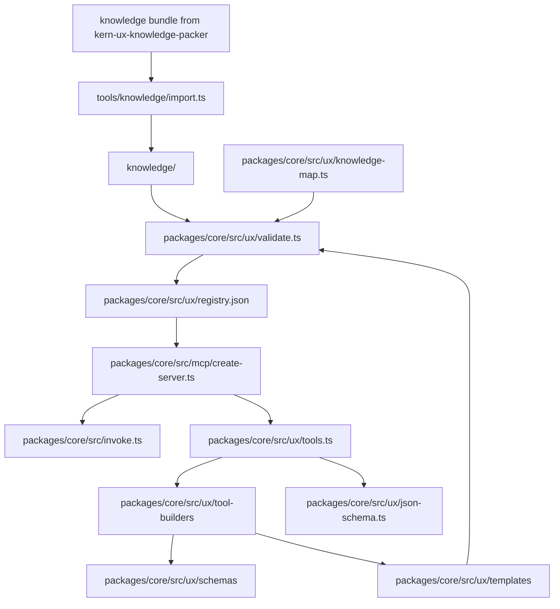

# Codebase Guide

This document is the short map for contributors who need to navigate the repo without reverse-engineering the whole runtime.

## Mental Model

The project has a build-time metadata pipeline and a runtime tool pipeline.


```mermaid
flowchart TD
  A[knowledge bundle from kern-ux-knowledge-packer] --> B[tools/knowledge/import.ts]
  B --> C[knowledge/]
  C --> K[packages/core/src/ux/knowledge-projection.ts]
  M[packages/core/src/ux/knowledge-map.ts] --> K
  K --> D[packages/core/src/ux/registry.json]
  D --> E[packages/core/src/mcp/create-server.ts]
  E --> P[packages/core/src/invoke.ts]
  E --> F[packages/core/src/ux/tools.ts]
  F --> G[packages/core/src/ux/tool-builders]
  G --> H[packages/core/src/ux/schemas]
  G --> I[packages/core/src/ux/templates]
  F --> J[packages/core/src/ux/json-schema.ts]
  I --> K[packages/core/src/ux/validate.ts]
```

Important distinction:

- The registry provides component metadata at runtime: titles, status, canonical HTML and docs. It doesn't decide which tools exist: `COMPONENT_TOOLS` in [packages/core/src/ux/tool-builders/component-tools.ts](../packages/core/src/ux/tool-builders/component-tools.ts) lists the component tools and how each is built, and the catalog fails if the registry lacks one of them.
- The Zod schemas live in code under [packages/core/src/ux/schemas](../packages/core/src/ux/schemas) and remain the source of truth for tool inputs.
- MCP clients see JSON Schema because [packages/core/src/ux/json-schema.ts](../packages/core/src/ux/json-schema.ts) converts those Zod schemas when tools are listed.

## Directory Map

The repo is an npm workspace:

- [packages/core](../packages/core): `@leonio/kern-ux-core`, everything below except the entry point. It's private and never published: the hosts import it from source (the `@leonio/source` export condition) and esbuild inlines it into their bundles.
- [packages/stdio](../packages/stdio): `@leonio/kern-ux-mcp`, the published stdio server.
- [packages/http](../packages/http): `@leonio/kern-ux-mcp-http`, the published Streamable HTTP server. `src/server.ts` is the `node:http` host (Host/Origin guards, CORS, rate limit, bearer token, probes, drain), `src/config.ts` reads its environment variables. `Dockerfile` and `compose.yaml` build the container image from the standalone bundle; build from the repo root (the root `.dockerignore` applies).

- [packages/stdio/src/index.ts](../packages/stdio/src/index.ts): stdio entry point (`serveStdio`), serving 2026-07-28 and 2025-era clients.
- [packages/core/src/mcp](../packages/core/src/mcp): MCP SDK v2 wiring. `create-server.ts` registers every tool on `McpServer`, `kern-schema.ts` adapts each tool's Zod schema for the SDK (our JSON Schema, our validation hints), and `catalog.ts` builds the tool definitions once per process.
- [packages/core/src/invoke.ts](../packages/core/src/invoke.ts): the call pipeline independent of the SDK: argument normalization, input parsing, validation hints, handler and output validation.
- [packages/core/src/ux/tools.ts](../packages/core/src/ux/tools.ts): creates the tool registry, selects tool builders, lists tools for MCP.
- [packages/core/src/ux/tool-builders](../packages/core/src/ux/tool-builders): strategy-specific tool construction shared across many components. `component-tools.ts` says which components get a tool and which builder makes it.
- [packages/core/src/ux/schemas](../packages/core/src/ux/schemas): Zod schemas for tool inputs.
- [packages/core/src/ux/templates](../packages/core/src/ux/templates): HTML rendering for components and composition blocks.
- [packages/core/src/ux/json-schema.ts](../packages/core/src/ux/json-schema.ts): converts Zod input schemas to JSON Schema.
- [packages/core/src/ux/registry.json](../packages/core/src/ux/registry.json): the generated runtime data, projected from the knowledge bundle. Don't edit it by hand.
- [packages/core/src/ux/registry.ts](../packages/core/src/ux/registry.ts): loads it; [registry.schema.ts](../packages/core/src/ux/registry.schema.ts) is its contract.
- [packages/core/src/ux/knowledge-map.ts](../packages/core/src/ux/knowledge-map.ts): the code-owned map from KERN's IDs to ours, the example each fallback tool returns, and the docs sections `get_grid`'s entry is made of.
- [packages/core/src/ux/tool-hints.ts](../packages/core/src/ux/tool-hints.ts): the one-line hints from KERN's guidance that some tool descriptions carry, written by the [tool-hints skill](../.github/skills/tool-hints/SKILL.md) with their source's hash.
- [packages/core/src/ux/knowledge-import.ts](../packages/core/src/ux/knowledge-import.ts) and [knowledge-projection.ts](../packages/core/src/ux/knowledge-projection.ts): the import's checks and diff, and the projection to `registry.json`. Build-time only.
- [packages/core/src/ux/validate.ts](../packages/core/src/ux/validate.ts): strict HTML validation rules used by tools.
- [knowledge](../knowledge): the KERN knowledge bundle as imported, checked in so upstream changes arrive as diffs. Never shipped; never edited by hand.
- [tools/knowledge](../tools/knowledge): `npm run knowledge:import`, which validates a bundle against the packer's schema and our checks, prints what changes, replaces `knowledge/` and regenerates `registry.json`.
- [tools/build/sbom.ts](../tools/build/sbom.ts): writes a host package's CycloneDX SBOM (`npm run sbom`), which the release ships in the tarball and attests for the image and the `.mcpb`.
- [tools/build/mcpb.ts](../tools/build/mcpb.ts): packs `packages/stdio` as an MCP Bundle (`.mcpb`) from its standalone bundle and the `packages/stdio/mcpb/manifest.json` template, adding the version and the static `tools[]` list.
- [tools/build/bundle.ts](../tools/build/bundle.ts): bundles a host package with esbuild: `dist/` for npm (core inlined, third-party packages external, undeclared imports fail the build) and `standalone/` for MCPB and the container (everything inlined, plus `THIRD_PARTY_LICENSES.txt`).
- [docs](../docs): contributor docs, the migration notes, the plans, and historical notes.
- [.github/instructions](../.github/instructions): targeted file-scoped workflow rules.
- [.github/skills/component-update-workflow](../.github/skills/component-update-workflow): self-contained workflow skill with YAML references.
- [samples/basic-layout](../samples/basic-layout): sample app and MCP wiring for local development.

## Common Change Paths

### 1. Change component rendering

Typical path:

1. Update the component schema in [packages/core/src/ux/schemas](../packages/core/src/ux/schemas).
2. Update the matching renderer in [packages/core/src/ux/templates](../packages/core/src/ux/templates).
3. Update the nearest focused tests.

This is the normal path when you change HTML output, validation-friendly defaults, or input shape.

### 2. Take in new KERN knowledge

Typical path:

1. Run the packer (`kern-ux-knowledge-packer`), which writes the bundle to its `bundle/final`.
2. `npm run knowledge:import -- <bundle-dir> --dry-run` to see what changes, then without `--dry-run` to replace `knowledge/` and regenerate `registry.json`.
3. `npm test`, and review the snapshot diffs.

KERN knowledge (titles, statuses, summaries, do's and don'ts, docs sections, WCAG criteria) comes only from the bundle. Facts about our tools are code: the notes in [packages/core/src/ux/tool-notes.ts](../packages/core/src/ux/tool-notes.ts), the ID map in [knowledge-map.ts](../packages/core/src/ux/knowledge-map.ts). After changing the map, run `npm run knowledge:import` without a path.

### 3. Change the MCP surface

Typical path:

1. Update [packages/core/src/ux/tools.ts](../packages/core/src/ux/tools.ts) or a file in [packages/core/src/ux/tool-builders](../packages/core/src/ux/tool-builders). A new component tool also needs an entry in `COMPONENT_TOOLS` (`component-tools.ts`), and a component in the bundle that `knowledge-map.ts` maps to it.
2. If tool input listing changes, check [packages/core/src/ux/json-schema.ts](../packages/core/src/ux/json-schema.ts).
3. If request handling or validation messaging changes, check [packages/core/src/invoke.ts](../packages/core/src/invoke.ts) and [packages/core/src/mcp](../packages/core/src/mcp).

This is the normal path when you add a tool, change how tools are listed, or adjust validation behavior at the MCP boundary.

## Build And Validation Commands

Install:

```bash
npm install
```

Regenerate the registry from `knowledge/`:

```bash
npm run knowledge:import
```

Build:

```bash
npm run build
```

Validate code:

```bash
npm run lint
npx tsc --noEmit
npm run test
```

Focused knowledge workflow:

```bash
npm run knowledge:import -- <bundle-dir> --dry-run
npm test -- packages/core/src/ux/knowledge tools/knowledge packages/core/src/ux/tools.behaviour.test.ts packages/core/src/ux/tools.listing.test.ts
```

## Where To Start Reading

- Runtime behavior: start at [packages/core/src/mcp/create-server.ts](../packages/core/src/mcp/create-server.ts), then [packages/core/src/invoke.ts](../packages/core/src/invoke.ts) and [packages/core/src/ux/tools.ts](../packages/core/src/ux/tools.ts).
- Tool input/output shape: start at [packages/core/src/ux/schemas](../packages/core/src/ux/schemas) and [packages/core/src/ux/templates](../packages/core/src/ux/templates).
- KERN knowledge: start at [tools/knowledge/import.ts](../tools/knowledge/import.ts), then [knowledge-projection.ts](../packages/core/src/ux/knowledge-projection.ts).
- Component changes end to end: load [../.github/skills/component-update-workflow/SKILL.md](../.github/skills/component-update-workflow/SKILL.md).