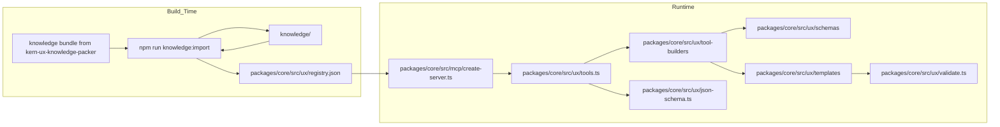

# Contributor Guide

This guide is for contributors changing schemas, templates, the KERN knowledge import, or the notes about our tools. Runtime consumers should start with [README.md](../README.md).

## How It Fits Together



At runtime the registry decides which tools and component metadata are exposed. The tool builders bind that metadata to Zod schemas from [packages/core/src/ux/schemas](packages/core/src/ux/schemas), and [packages/core/src/ux/json-schema.ts](packages/core/src/ux/json-schema.ts) converts those Zod schemas to JSON Schema for MCP tool discovery.

## Runtime vs Build Surface

Runtime flow:

- `packages/stdio/src/index.ts` -> `packages/core/src/mcp/create-server.ts` (SDK v2 `McpServer`) -> `packages/core/src/ux/tools.ts`
- the call pipeline in `packages/core/src/invoke.ts`, used through the `kernInputSchema` adapter in `packages/core/src/mcp/kern-schema.ts`
- strategy builders in `packages/core/src/ux/tool-builders/`
- component schemas in `packages/core/src/ux/schemas/`
- HTML templates in `packages/core/src/ux/templates/`
- generated runtime registry in `packages/core/src/ux/registry.json`, a JSON import in `packages/core/src/ux/registry.ts`

Build-only tooling:

- knowledge import: `tools/knowledge/import.ts`, with the checks and diff in `packages/core/src/ux/knowledge-import.ts` and the projection in `packages/core/src/ux/knowledge-projection.ts`
- the ID map: `packages/core/src/ux/knowledge-map.ts`
- local dev loop script: `tools/dev/dev-loop.ps1`

## The runtime registry

`packages/core/src/ux/registry.json` holds only what the server serves, with our component IDs. `npm run knowledge:import` generates it from `knowledge/`; nobody edits it by hand. Its contract is `RegistryManifestSchema` in `packages/core/src/ux/registry.schema.ts` (major 2), and tests check the checked-in file against the contract and against a fresh projection of `knowledge/`.

Per component, from the bundle:

- our ID (KERN's without hyphens, through `knowledge-map.ts`) and KERN's ID
- title, status (`stable`, `experimental`, `deprecated` or `docs-only`), group, synonyms, links
- the English summary, when to use, do's and don'ts, and similar components, as the bundle has them
- the docs page's sections with their English summaries and links
- the WCAG criteria, one per criterion with the strictest status
- the kern-ux-plain sources
- `htmlCanonical`, only for the four fallback tools, picked by example ID in `knowledge-map.ts`

`get_grid` is the exception: it renders the CSS Grid utilities, which replace KERN's deprecated container grid. Its entry is a run of sections of the utilities page (`TOOLS_FROM_SECTIONS` in `knowledge-map.ts`), and KERN's `grid` component isn't in the registry.

Plus the upstream pins from the bundle's index, and the token names, carried over from the previous registry until the bundle has tokens.

## Importing KERN knowledge

The packer (`kern-ux-knowledge-packer`) owns the bundle and its schema, and knows nothing about this repo. To take in a new bundle:

```bash
npm run knowledge:import -- ../kern-ux-scraper/bundle/final --dry-run   # check it and print what changes
npm run knowledge:import -- ../kern-ux-scraper/bundle/final             # replace knowledge/ and regenerate registry.json
npm run knowledge:import                                                 # regenerate registry.json from knowledge/ only
```

The import validates every file against the schema that ships inside the bundle, then runs the checks only this repo can make: the bundle's major version is one we read, every component tool finds its component, the picked examples exist, and no status is new to the tools. It prints the bundle's version, the packer's text and drift counts, and what changed per file. After an import, run `npm test` and review the snapshot diffs: tool titles and `get_component_docs` come from the registry.

The build inlines `registry.json` into each host bundle; `knowledge/` is never shipped. If you only run the server, you don't need the import.

## Guidance Sources

Use checked-in evidence in this order:

1. curated docs snapshots if present
2. `kern-ux-plain` stories and upstream source
3. local schemas in `packages/core/src/ux/schemas/`
4. local templates in `packages/core/src/ux/templates/`
5. local tests and validation rules

KERN's guidance comes from the knowledge bundle. Reviewed notes about our tools (where a tool deliberately differs from upstream KERN) live in `packages/core/src/ux/tool-notes.ts`. The end-to-end workflow is in `.github/skills/component-update-workflow/SKILL.md`.

## Schema Context

Schema layer map:

```text
packages/core/src/ux/schemas/foundations.ts     - shared primitives
packages/core/src/ux/schemas/<component>.ts     - per-component Zod schemas
packages/core/src/ux/schemas/content-union.ts   - recursive discriminated union for render_composition
packages/core/src/ux/tool-builders/shared.ts    - output validation and shared builder helpers
packages/core/src/ux/tools.ts                   - createTools() wires schemas to MCP tools
```

Known recursive schema note:

- `render_composition` depends on recursive Zod schemas built with `z.lazy()`.
- `packages/core/src/ux/json-schema.ts` must keep emitting ref-preserving JSON Schema for recursive tool schemas.
- Flattening recursive positions to inline `{}` breaks `render_composition` tool discovery and weakens validation tests.

Current high-value schema facts:

- `checkbox` list mode uses `groupName` as the shared `name` source for all list items.
- `input-date` is still a repo-level simplification over the upstream grouped day/month/year pattern.
- `dropdown` remains explicitly experimental.
- `kopfzeile` renders the CSS variant of the upstream Kopfzeile, not the `<kern-kopfzeile>` web component.

## Testing

Tests are colocated with the code as `packages/*/src/**/*.test.ts` and run with Vitest:

```bash
npm test               # full suite
npm run test:watch     # watch mode
npm run test:coverage  # suite + coverage; fails below the thresholds in vitest.config.ts
npm test -- packages/core/src/ux/validate.test.ts   # a single file
```

End-to-end tests (`packages/*/src/*.e2e.ts`) spawn the built hosts as separate processes, so build first:

```bash
npm run build && npm run test:e2e
```

CI also runs them against the npm tarballs installed into an empty directory (`KERN_E2E_INSTALL_DIR`) and against the container image (`KERN_E2E_HTTP_URL`).

Where tests live:

```text
packages/core/src/mcp/create-server.test.ts      - end-to-end: real MCP client on both eras (list, call, errors)
packages/core/src/mcp/listing.test.ts            - wire listing equals the domain snapshot; raw wire snapshot
packages/core/src/ux/tools.listing.test.ts       - contract snapshot of the full tools/list output
packages/core/src/ux/tools.routing.test.ts       - which builder each component/strategy gets
packages/core/src/ux/tools.input-schemas.test.ts - guidance text that must stay in the listed JSON schemas
packages/core/src/ux/tools.descriptions.test.ts  - guidance text that must stay in tool descriptions
packages/core/src/ux/tools.behaviour.test.ts     - utility/discovery/docs tool output
packages/core/src/ux/validate.test.ts            - one failing and one passing case per validation rule
packages/core/src/ux/templates/*.test.ts         - per-template rendering
packages/core/src/test-support/                  - shared helpers (test-only, never bundled)
```

Tool-listing snapshot:

- `packages/core/src/ux/__snapshots__/tools-list.json` holds everything clients see from `tools/list`: tool names, descriptions and JSON input schemas, built from the checked-in `registry.json`.
- A failing snapshot means clients would see a change. If the change is intended, update the snapshot and review the JSON diff in the PR:

  ```bash
  npx vitest run -u packages/core/src/ux/tools.listing.test.ts
  ```

- CI never writes snapshots. A missing or stale snapshot fails the build, so generate it locally and commit it.
- Biome ignores `**/__snapshots__`, because snapshots use two-space indentation.

Conventions:

- No `any` in tests. Biome's `noExplicitAny` applies to test files too. Use the helpers in `packages/core/src/test-support/`:
  - `createRegistry` and `invokeTool` for tool calls
  - `getListedToolSchema`, `schemaVariants`, `findVariant` and the `JsonSchemaNode` type for JSON Schema assertions
- For deliberately invalid input that checks a runtime guard, put `// @ts-expect-error <reason>` on the offending line instead of casting.
- Assert on specific `ruleId`s, or on the full list of rule IDs, rather than only `ok`. That way a test can't pass because a different rule happened to fire.
- Keep the default 5s timeout. If a test is slow, fix the setup rather than raising the limit. For example, import modules statically instead of calling `await import()` inside a test, and don't recompute expensive data per assertion.

Coverage:

- Thresholds live in `vitest.config.ts` and sit just below the measured baseline. Raise them as coverage improves, and never lower them to make a PR pass.
- `packages/stdio/src/index.ts` is excluded because it only wires stdio. `packages/core/src/mcp/create-server.test.ts` covers `createKernServer()` end to end on both protocol eras (2025-11-25 and 2026-07-28).
- CI adds a coverage table to the job summary and uploads the HTML report as the `coverage-report` artifact. Locally, open `coverage/index.html`.

Module cache:

- `fsModuleCache: true` keeps transformed modules between runs, in `node_modules/.vitest-cache`. It's keyed on file content, so edits invalidate it, and a reinstall clears it.
- If results ever look stale, run with `--fsModuleCache=false`, or inspect the cache with `DEBUG=vitest:cache:fs npm test`.

## Architecture Rules

- Public MCP tool names stay `get_<component-id>` plus utility tools.
- `checkboxlist` remains merged into `get_checkbox`.
- `strict: true` must keep throwing on validation failures.
- Keep KERN's guidance (from the bundle) and the notes about our tools (`tool-notes.ts`) separate.
- The `tools/list` output is a public contract. Refactors must leave the tool-listing snapshot unchanged, and a deliberate change must show up as a reviewed snapshot diff.

## Repo Customizations

- Always-on repo invariants live in `.github/copilot-instructions.md`.
- File-scoped component-change rules live in `.github/instructions/component-change.instructions.md`.
- The end-to-end contributor workflow lives in `.github/skills/component-update-workflow/SKILL.md` and its bundled YAML references.

## Historical Context

The implementation rationale for the reviewed-guidance workflow is preserved in [air-gapped-guidance-plan.md](air-gapped-guidance-plan.md). Treat it as historical design context, not the primary operational guide.