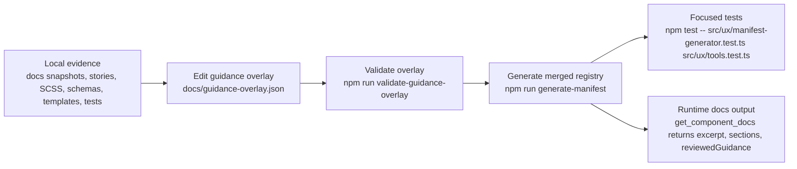

# Guidance Overlay Workflow

This repo now has a deterministic reviewed-guidance workflow layered on top of the generated KERN manifest.

The purpose of the overlay is to capture guidance that is too semantic, too cautionary, or too repo-specific to be extracted reliably from stories, SCSS comments, and upstream docs alone.

## Flow



## Artifacts

- Generated implementation facts: `src/ux/registry.json`
- Overlay contract: `docs/guidance-overlay.schema.json`
- Reviewed overlay payload: `docs/guidance-overlay.json`
- Operator guide: `docs/guidance-overlay-workflow.md`
- Drafting prompt: `.github/prompts/draft-guidance-overlay-entry.prompt.md`
- Workflow skill: `.github/skills/component-update-workflow/SKILL.md`
- Repo instructions: `.github/copilot-instructions.md`

## What Belongs Where

Use the generated manifest for:

- component inventory
- story-derived canonical HTML
- extracted source guidance
- source file references
- build-time warnings and status

Use the reviewed overlay for:

- explicit MCP simplifications
- anti-use guidance
- accessibility obligations that need stable wording
- migration notes for known repo drift
- evidence-backed authoring notes

## Manual Update Loop

1. Choose a component whose guidance needs review or correction.
2. Optionally start from `.github/prompts/draft-guidance-overlay-entry.prompt.md` if you want Copilot to draft one entry at a time.
3. Gather evidence from checked-in local sources in this order:
   - docs snapshots or curated docs exports
   - `kern-ux-plain` stories and source files
   - local schemas and templates in `src/ux/`
   - local tests and validation rules
4. Add or update the component entry in `docs/guidance-overlay.json`.
5. Keep every statement evidence-backed.
6. Run:

```bash
npm run validate-guidance-overlay
npm run generate-manifest
npm test -- src/ux/manifest-generator.test.ts src/ux/tools.test.ts
```

7. Review the diff in `docs/guidance-overlay.json` and `src/ux/registry.json`.
8. Review the output shape of `get_component_docs` if the change affects curated guidance.
9. Merge only after human review.

## Runtime Shape

Curated guidance stays separate from extracted guidance at runtime.

- `guidance` and `guidanceSections` remain source-extracted material.
- `reviewedGuidance` is the reviewed overlay payload merged at build time.
- `get_component_docs` returns all three so callers can distinguish raw source extraction from reviewed repo guidance.

## Authoring Rules

- Do not replace extracted `guidance` or `guidanceSections`; the overlay augments them.
- Prefer small, high-value entries over broad speculative coverage.
- Keep statements stable and specific.
- Surface uncertainty explicitly instead of inventing guidance.
- Treat `status` as review state, not as runtime feature availability.

## Entry Shape

Each component entry must include:

- `status`
- `summary`
- `primaryUseCases`
- `antiUseCases`
- `requiredA11yPractices`
- `semanticInvariants`
- `compositionPatterns`
- `authoringNotes`
- `migrationNotes`

Each statement includes:

- localized text (`de`, `en`)
- confidence (`high`, `medium`, `low`)
- at least one evidence reference

## Initial Seed Components

The current overlay is intentionally small and starts with known drift points:

- `kopfzeile`
- `inputdate`
- `dropdown`

Add more components in small reviewed batches rather than trying to backfill the full library in one pass.

## AI Authoring Support

The current repo setup intentionally starts with lightweight authoring support:

1. `.github/copilot-instructions.md` provides always-on project and workflow rules.
2. `.github/instructions/guidance-overlay.instructions.md` loads file-scoped overlay rules only when overlay or manifest files are in play.
3. `.github/skills/component-update-workflow/SKILL.md` provides the self-contained end-to-end workflow with YAML routing references.
4. `.github/prompts/draft-guidance-overlay-entry.prompt.md` remains the opt-in drafting template for one component entry.

This keeps the workflow structured without pushing the full process into always-on instructions.

Add another dedicated skill only if the current workflow skill proves too broad or the contributor path splits into clearly separate overlay-only and runtime-only routines.