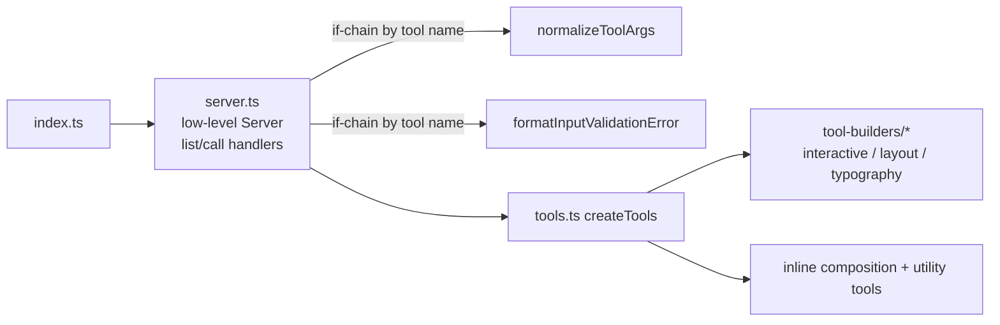

# Plan v2: progressive architecture improvements

This folder records the architecture opportunities found during discovery for the TypeScript 7 upgrade (branch `chore/ts7`). The goal is to improve the codebase in small, independently shippable steps. There is no big-bang rewrite.

- Detailed write-ups, with file references, are in [findings.md](findings.md).
- The current runtime map is in [../codebase-guide.md](../codebase-guide.md).

## Roadmap to 2.0 (MCP 2026-07-28)

The P1–P4 phases below are now folded into a larger roadmap, [roadmap.md](roadmap.md). It covers:

- the move to MCP protocol `2026-07-28` and TypeScript SDK v2
- a private core library, with stdio/MCPB and Streamable HTTP hosts built on it
- MCP resources and prompts
- English as the base language for LLM-facing text

The roadmap runs in steps R0–R7 on the `feat/v2-alpha` branch, and has its own status tracker. Background for the new steps is in findings 17–21. The phase table and item tracker below show which roadmap step picks up each existing item.

## Where we are today

`src/index.ts` is a thin entry point: it creates the server and connects stdio. The actual wiring lives in `src/server.ts` and `src/ux/tools.ts`:

The main problem is that knowledge about a single tool is spread across several places:

- its schema is in `schemas/`
- its builder and description are in `tool-builders/` or `tools.ts`
- its argument normalisation and error hints are in `server.ts`, keyed by name strings
- the rule that decides which builder is used is in both `tools.ts` and `interactive.ts`

## Target shape

- Each tool is one self-describing, strongly typed definition: schema, handler, and optional `normalize` and `errorHint`.
- `server.ts` becomes a generic pipeline that knows no tool names.
- Tool selection is declared once, as data.

## Phases

Each phase is independently releasable. Items refer to [findings.md](findings.md).

| Phase | Theme | Items | Status | Roadmap step |
|-------|-------|-------|--------|--------------|
| P0 | TS7 and Vitest 5 upgrade, test hardening (see the "Testing" section of [../contributor-guide.md](../contributor-guide.md#testing)) | n/a | Done | n/a |
| P1 | Low-risk cleanups | 4, 10, 12, 14, 16 | Not started | R1 (4, 10, 12, 16), R3 (14) |
| P2 | Co-locate per-tool behaviour and extract the call pipeline | 2, 3, 5 | Not started | R1 (3), ongoing `defineTool()` migration (2, 5) |
| P3 | Typed and declarative tool definitions | 6, 7, 8, 9, 11, 13 | Not started | R1 (13), R4 (9), ongoing migration (6, 7, 8, 11) |
| P4 | Spike: high-level `McpServer` API | 15 | Superseded | R0 spike and R2 SDK v2 swap |

## P0 follow-ups

- [x] Run the last batch of new tests (`input-file`, `typography`, `content-union`, and the `tools.routing`/`tools.behaviour` additions) and fix any failures.
- [x] Raise the coverage thresholds in `vitest.config.ts` to just below the new baseline. The run before that batch was 90.0 / 83.2 / 89.6 / 90.2.

## Item tracker

- [ ] 1. The entry-point and wiring overview is documented. It's context only, with nothing to change.
- [ ] 2. Move per-tool `normalize` and `errorHint` onto `ToolDef`. → ongoing `defineTool()` migration
- [x] 3. Extract `invokeTool()` and a `logging.ts` module from `server.ts`. → R1
- [x] 4. Create a single `ValidationResultSchema` and output schema. → R1
- [ ] 5. Create a generic `buildHtmlTool()` for section, card_group, disclosure and composition. → ongoing migration
- [ ] 6. Build a declarative interactive tool map to replace the set, the switch and the 26 small builders. → ongoing migration
- [ ] 7. Remove the double routing in `createTools`. → ongoing migration
- [ ] 8. Add a `defineTool<I, O>()` helper that infers handler types from the schemas. → ongoing migration (the first PR)
- [ ] 9. Extract `createCompositionRenderer(locale)`. → R4
- [x] 10. Read the server version from package.json. → R1
- [ ] 11. Have builders report the component ID, instead of parsing tool names. → ongoing migration
- [x] 12. Remove dead code and deduplicate `stories.ts` and `paths.ts`. → R1
- [x] 13. Type-check `tools/**` and `vitest.config.ts`. → R1
- [ ] 14. Optional hardening: `verbatimModuleSyntax`, ES2024 target, ~~Biome schema version~~ (done: 2.5.14). → R3 (`tsconfig.base.json`)
- [ ] 15. Spike `McpServer.registerTool`. → superseded by R0 and R2 (SDK v2)
- [x] 16. Keep a single `formFlow` schema. The copy in `schemas/form-flow.ts` is dead at runtime and duplicated inline in `content-union.ts`. → R1
- [ ] 17. SDK v2 migration facts. → R0, R2
- [ ] 18. Composition gaps and bugs. → R4
- [ ] 19. Context budget of `tools/list`. → R5
- [x] 20. Release config: GitVersion branch entry and typo. → R1
- [x] 21. Leaks and packaging: `sourceRoot`, `fast-glob`, unbounded `validate_html` input. → R1

## Ground rules

- Each item must keep the tool names, input JSON Schemas and output shapes byte-compatible, unless the item explicitly says otherwise. MCP clients depend on them.
- The 2.0 roadmap makes the changes listed under "Contract" in [roadmap.md](roadmap.md#decisions) on purpose: `isError` results, `outputSchema` with `structuredContent`, titles and annotations, and input schemas that shrink the context. Each one lands in its own PR, with the snapshot diff reviewed. Tool names stay stable.
- The `src/ux/tools.*.test.ts` files and `src/server.*.test.ts` (especially `server.mcp.test.ts`) are the safety net. Add characterisation tests first where they're missing.
- Aim for one item, or a small group of related items, per PR.
