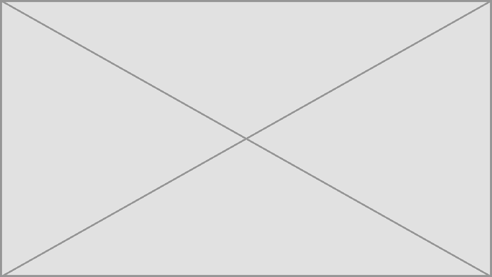

# Set up Claude Desktop

Claude Desktop runs local servers over stdio. For HTTP it only connects to servers it can reach from the internet.

## stdio

### Option 1: the MCP bundle (recommended)

No Node.js setup or config file needed.

1. Download `kern-ux-mcp-<version>.mcpb` from the [GitHub releases](https://github.com/leonio/kern-ux-mcp/releases).
2. Open the file (double-click it, or drag it onto Claude Desktop). Claude Desktop shows an install dialog.

   

3. Click **Install**. The extension appears under **Settings → Extensions**, where you can also turn on **Debug logging**.

The bundle needs Node.js 24.16 or later, either built into Claude Desktop or installed on your system.

### Option 2: the config file

1. Open **Settings → Developer → Edit Config**. This opens `claude_desktop_config.json`:
   - macOS: `~/Library/Application Support/Claude/claude_desktop_config.json`
   - Windows: `%APPDATA%\Claude\claude_desktop_config.json`
2. Add the server:

   ```json
   {
     "mcpServers": {
       "kern-ux": {
         "command": "npx",
         "args": ["-y", "@leonio/kern-ux-mcp@alpha"]
       }
     }
   }
   ```

3. Quit Claude Desktop completely and start it again.
4. In a new chat, open the tools menu: `kern-ux` is listed with its tools.

   

## HTTP

Claude Desktop connects to remote MCP servers as **custom connectors**, and those connections come from Anthropic's servers, not from your machine. So `http://localhost:3000/mcp` won't work. You need a public HTTPS URL:

1. Run the HTTP server with a token, behind HTTPS. For local testing a tunnel works:

   ```bash
   cloudflared tunnel --url http://localhost:3000
   # prints https://<name>.trycloudflare.com
   ```

   and allow that hostname: `KERN_ALLOWED_HOSTS=localhost,<name>.trycloudflare.com` (see [HTTP server with Docker](HTTP-Server-with-Docker#reaching-it-from-outside-your-machine)).
2. In Claude Desktop, open **Settings → Connectors → Add custom connector**, and enter `https://<name>.trycloudflare.com/mcp`.

   

> The tunnel makes your server public. Set `KERN_AUTH_TOKEN` if your connector setup can send it, and stop the tunnel when you're done. Custom connector options depend on your Claude plan; check Anthropic's help pages if you don't see the menu.

For one person on one machine, stdio is simpler.

## If it doesn't work

- **The server doesn't appear**: check **Settings → Developer** for its status and the log. A JSON typo in the config file stops all servers from loading.
- **"Node not found" or a version error**: install Node.js 24.16+, or use the `.mcpb` bundle.
- More in [Debugging and troubleshooting](Debugging-and-Troubleshooting).
